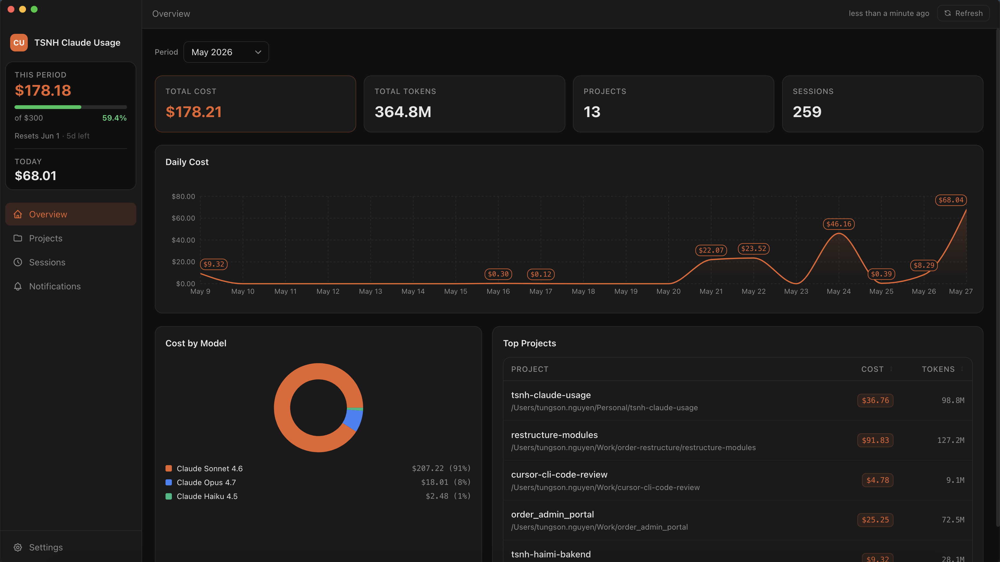
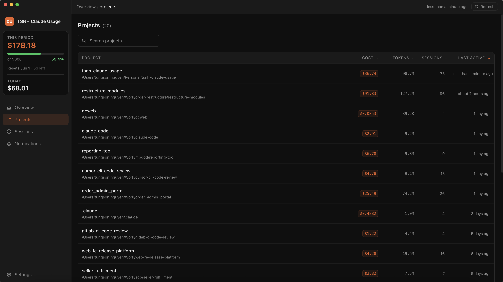
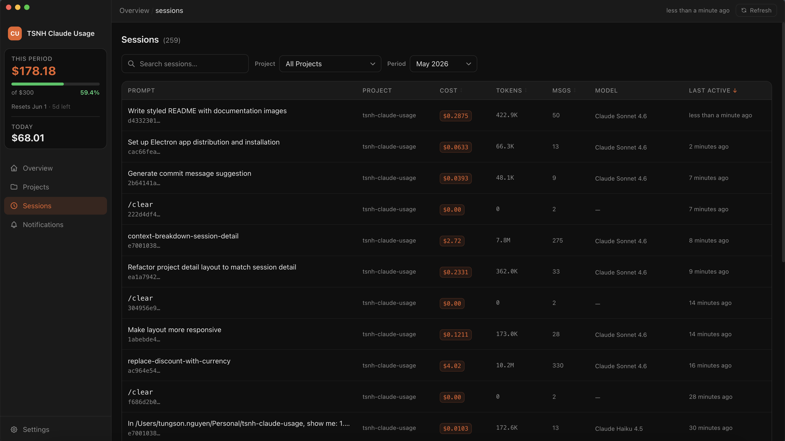
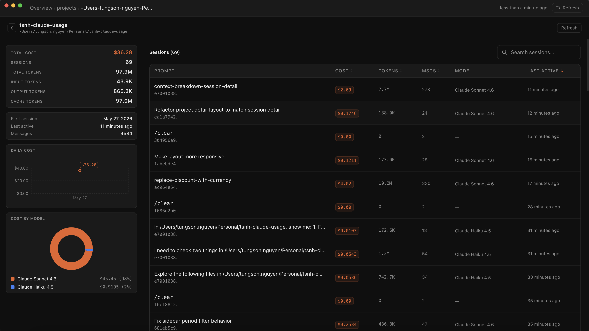
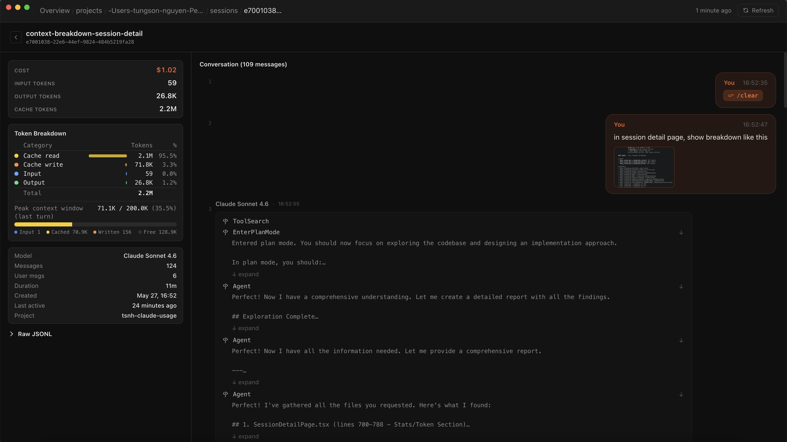
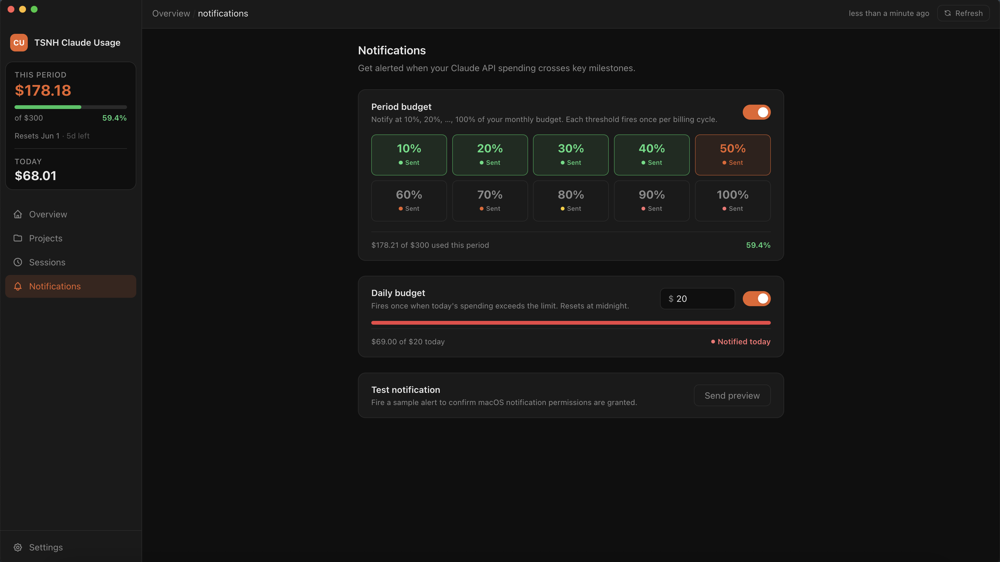
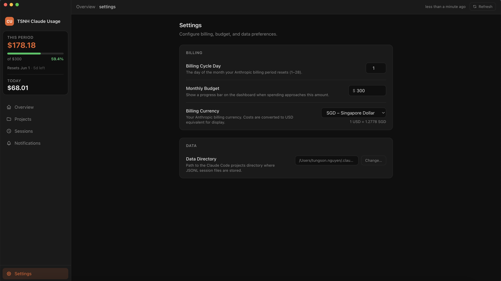

# TSNH Claude Usage

> A local-first macOS desktop app that tracks your Claude Code spending — cost, tokens, sessions, and full conversation transcripts — directly from your `~/.claude/projects/` data.



---

## Features

- **Real-time cost dashboard** — total spend, token usage, daily cost chart, and per-model breakdown at a glance
- **Project & session explorer** — drill into any project or individual session with full conversation transcripts
- **Token breakdown** — see cache read, cache write, input, and output tokens per session with context window utilization
- **Budget notifications** — set a monthly budget and daily limit; get macOS alerts at configurable thresholds (10 % → 100 %)
- **Multi-currency support** — display costs in your local currency (SGD, USD, EUR, and more)
- **Menu bar widget** — a compact tray popover shows your current period spend without opening the full dashboard
- **Persistent filters** — date range, project filter, and search state survive app restarts
- **Local-first & read-only** — reads only from `~/.claude/projects/`; never modifies your data, no telemetry, no network requests

---

## Screenshots

### Overview

The main dashboard shows total cost, token volume, daily spend over time, model distribution, and your most expensive projects.


### Projects

Browse all Claude Code projects sorted by cost, token count, or last-active date.



### Sessions

Search and filter across all sessions by project, date range, or prompt text.



### Project Detail

Per-project view with aggregated stats, a cost-by-model breakdown, and a full session list.



### Session Detail

Full conversation transcript with per-turn metadata, a token breakdown table, and peak context window utilization.



### Notifications

Set period-budget milestones and a daily spending cap. Fires a macOS notification the first time each threshold is crossed per billing cycle.



### Settings

Configure your billing cycle day, monthly budget, display currency, and Claude projects directory.



---

## Getting Started

### Prerequisites

- macOS
- [Node.js](https://nodejs.org/) ≥ 18
- [pnpm](https://pnpm.io/)

### Install & run

```bash
git clone https://github.com/<your-username>/tsnh-claude-usage.git
cd tsnh-claude-usage
pnpm install
pnpm dev
```

The app lives in the menu bar. Click the tray icon to open the popover, or use the **Open Dashboard** button for the full window.

### Build a distributable

```bash
pnpm dist:mac   # produces a .dmg in release/
```

---

## Configuration

All settings are available in the **Settings** page inside the app:

| Setting | Description |
|---|---|
| **Billing Cycle Day** | Day of the month your Anthropic billing period resets (1–28) |
| **Monthly Budget** | Shows a progress bar in the sidebar when spending approaches this amount |
| **Billing Currency** | Your Anthropic billing currency; costs are converted for display |
| **Data Directory** | Path to your Claude projects folder (default: `~/.claude/projects`) |

---

## License

MIT
